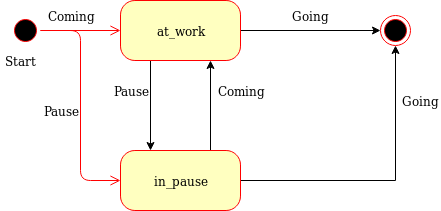

# Crewtime DSL

## Foreword
_This is a playground project to have a look at parsing DSLs with Ruby._

_The focus was on cleanly separating syntax (the parsing part) from the "business logic" (the interpreter)._

_Its only purpose is that I learned something :-)_

## DSL
This project implements a very simple domain specific languages to track worked time from time bookings.

The input is a stream of bookings (`Event`s) for a single day like this:

    COMING@2019-12-03T08:30:00
    PAUSE@2019-12-03T12:30:00
    COMING@2019-12-03T13:00:00
    GOING@2019-12-03T18:00:00

The output is a stream of `Interval`s (here formatted as JSON)

    {'type': 'working_time', 'from': '2019-12-03T08:30:00+01:00', 'to': '2019-12-03T12:30:00+01:00' }
    {'type': 'pause_time', 'from': '2019-12-03T12:30:00+01:00', 'to': '2019-12-03T13:00:00+01:00' }
    {'type': 'working_time', 'from': '2019-12-03T13:00:00+01:00', 'to': '2019-12-03T18:00:00+01:00' }

To make this DSL a bit more interesting it contains some ambiguities. As you can see in the example above the `COMING` 
event can either mean _I started my working day_ or it can mean _I came back from my break_.

### Examples

Here are some examples (the timestamps are ignored, the anchors ^$ are not part of the grammar and just for
clarification of the examples):

#### Valid
    ^$  -- the simplest day: no booking
    ^COMING GOING$ -- a simple working day. Semantically this will be interpreted as working_time
    ^COMING PAUSE COMING GOING$ -- a working day with a pause. Semantically: [working_time, pause_time, working_time]
    ^COMING PAUSE GOING$ -- Special case: the pause is at the end of the working day and has no COMING booking. 
                            Semantically: [working_time, pause_time]
    ^COMING PAUSE COMING PAUSE COMING GOING$ -- Two pauses.
                                              Semantically: [working_time, pause_time, working_time, pause_time, working_time]

#### Invalid
    ^GOING$ -- no COMING event
    ^COMING$  -- no GOING event
    ^GOING COMING$ -- invalid (COMING and GOING in the wrong order)
    ^COMING GOING COMING GOING$ -- You cannot work "two times" a day

### Implementation

The goal of the implementation is to be very clear on the separation of concerns. Because of this the whole process is
broken into smaller steps with a clear responsibility.

1. **Parsing** of the text into tokens. The grammar used is as simple, as possible and only detects `COMING@...`/`GOING@...`/`PAUSE@...`. It does not even validate the correct format of the timestamps.
2. **Transforming** of the parse results into `Events`. In this step each `Event` is syntactically validated (-> timestamp) but nothing more.
3. **Interpretation** takes the events and applies the business logic.

A more concise implementation could have merged a lot of 1-3 into a single grammar & transformation, 
although at the cost of simplicity.

#### Parsing

Parsing is done via [parslet](http://kschiess.github.io/parslet/parser.html), a ruby library to implement grammars.

#### Transformation

The transformation into `Events` is also done via [parslet](http://kschiess.github.io/parslet/transform.html).
The only "business" logic in here is that timestamps are parsed (which prevents dates like the 32nd of June).

#### Interpretation

The business logic itself is comparably simple and can easily be implemented in a state machine.




## Installation

Add this line to your application's Gemfile:

```ruby
gem 'crewtime-parser'
```

And then execute:

    $ bundle

Or install it yourself as:

    $ gem install crewtime-parser

## Usage

_just don't use it :-)_

## Development

After checking out the repo, run `bin/setup` to install dependencies. Then, run `rake test` to run the tests. You can also run `bin/console` for an interactive prompt that will allow you to experiment.

To install this gem onto your local machine, run `bundle exec rake install`. To release a new version, update the version number in `version.rb`, and then run `bundle exec rake release`, which will create a git tag for the version, push git commits and tags, and push the `.gem` file to [rubygems.org](https://rubygems.org).

## Contributing

Bug reports and pull requests are welcome on GitHub at https://github.com/[USERNAME]/crewtime-parser.

## License

The gem is available as open source under the terms of the [MIT License](https://opensource.org/licenses/MIT).
